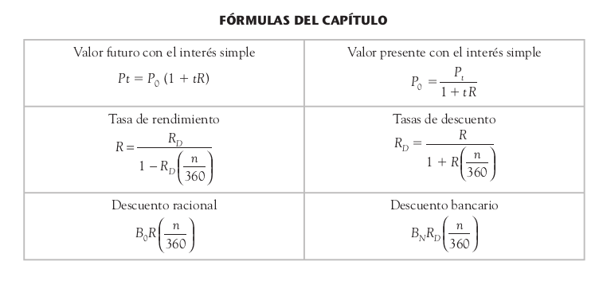
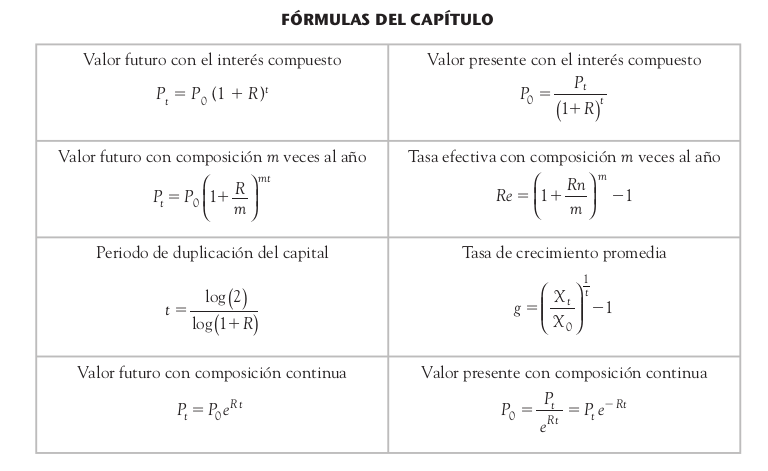

# FinancialMath
> A set of financial equations.

This library provides a set of financial equations.
This library is based on the book titled:

## Matemáticasfi nancieras
El valor del dinero en el tiempo

by *Zbigniew Kozikowski Zarska*
## Installation

Add this line to your application's Gemfile:

```ruby
gem 'financial_math'
```

And then execute:

    $ bundle

Or install it yourself as:

    $ gem install financial_math

  ## Content

  This cover the next topics in financial math:

  * Geometric Progression
  * Arithemetic Progression
  * Simple Interest
  * Compound Interest

More content will be added, soon, like:

* Annuities
* Valuation
* Amortization
* Stock market math

## Usage

To calculate the last item of a geometric progression:

```ruby
progression = FinancialMath::GeometricProgression.new(initial_value: 1100, ratio: 1.1, times: 5)
progression.last_item
```

To calculate the future value:

```ruby
class Accountant
  include FinancialMath::SimpleInterest
end

accountant = Accountant.new
accountant.future_value(present_value: 100_000.0, interest_rate: 0.05, periods: 3)
```
The interest rate must be in terms of years, if your problem is expressed in terms of days or months, provide the frequency of conversion and the periods in terms of days.

```ruby
class Accountant
  include FinancialMath::SimpleInterest
end

accountant = Accountant.new
accountant.future_value(present_value: 1500.0, interest_rate: 0.45, periods: 3, frequency: 360)
```

## Available simple interest formulas



## Available compound interest formulas



## Development

If want test this gem without clone this repo, type:

```shell
$ gem install financial_math --dev
```

This command will get the development dependencies installed too.

## Release History

* 1.0.1
    * FIX: Fix bad release
* 1.0.0
    * CHANGE: Remove `SimpleInterest()`
    * CHANGE: Remove `CompoundInterest()`
* 0.7.0
    * ADD: Add `present_value`, `continous_present_value` to `CompoundInterest` as public methods
    * ADD: Add `internal_rate_of_return`, `real_rate_of_return` and `a_good_investment?` to `CompoundInterest` as public methods
* 0.6.0
    * ADD: Add `@frequency` to `SimpleInterest` class
    * CHANGE: Change the `periods_in_days` mehtod to `factor` in `SimpleInterest`
* 0.5.0
    * ADD: Add `average_growth_rate` and `continous_future_value` public methods to `CompoundInterest` class
* 0.4.1
    * CHANGE: Update docs (module code remains unchanged)
* 0.4.0
    * ADD: Add `CompoundInterest` class
* 0.3.1
    * CHANGE: Update docs (module code remains unchanged)
* 0.3.0
    * ADD: Add `SimpleInterest` class
* 0.3.0
    * ADD: Add `GEometricProgression` class
* 0.2.0
    * ADD: Add `ArithemeticProgression` class
* 0.1.0
    * The first proper release
    * ADD: The basic file with basic equations
* 0.0.1
    * Work in progress

## Meta

Daniel Omar Vergara Pérez – [@dan1_net](https://twitter.com/dan1_net) – daniel.omar.vergara@gmail.com

[https://github.com/dany2691/](https://github.com/dany2691/)

## Contributing

Bug reports and pull requests are welcome on GitHub at https://github.com/dany2691/financial_math. This project is intended to be a safe, welcoming space for collaboration, and contributors are expected to adhere to the [Contributor Covenant](http://contributor-covenant.org) code of conduct.

## Contributing

1. Fork it (<https://github.com/dany2691/financial_math/fork>)
2. Create your feature branch (`git checkout -b feature/fooBar`)
3. Commit your changes (`git commit -am 'Add some fooBar'`)
4. Push to the branch (`git push origin feature/fooBar`)
5. Create a new Pull Request

## License

The gem is available as open source under the terms of the [MIT License](https://opensource.org/licenses/MIT).

## Code of Conduct

Everyone interacting in the FinancialMath project’s codebases, issue trackers, chat rooms and mailing lists is expected to follow the [code of conduct](https://github.com/[USERNAME]/financial_math/blob/master/CODE_OF_CONDUCT.md).
